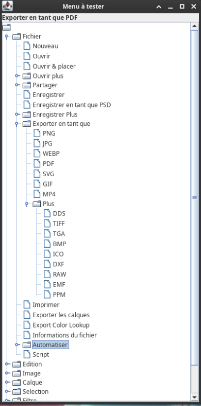

# SAE 3.1 2023 : Évaluation de menu 

### Explications
**Que fait ce code ?**
Ce programme contient deux codes: un pour les utilisateurs, et un pour les développeurs.
> Le premier, destiné aux utilisateurs, crée un arbre de type JTree, dont les noeuds sont récupérés puis construits depuis une base de données.
> Il existe plusieurs protocoles [détaillés plus bas](https://github.com/MathieuProal/BUT2-Menus/blob/main/README.md#protocoles), contenant chacun un identifiant, une tâche à accomplir sur le menu (un noeud à sélectionner), et la solution correcte attendue.
> Au début de chaque éxécution, une fenêtre s'ouvre pour demander à l'utilisateur quel protocole il souhaite utiliser.
> Après avoir choisi le protocole, l'arbre s'ouvre et l'utilisateur doit sélectionner une feuille. 
> Dès qu'il clique sur une feuille, la fenêtre se ferme et le programme s'arrête.

> Le second programme crée, depuis les résultats enregistrés à chaque test du premier programme, et après avoir demandé à l'utilisateur le protocole à suivre, un camembert qui indique la part d'échecs et de réussites.
> Un bouton basculer permet de visualiser un second camembert, qui affiche le nombre de sous-menus visités à chaque test.
> Tout cela permet de savoir si l'organisation du menu testé est optimale, et que les options sont là où l'utilisateur les cherche.

[Voir les différentes photos du programme](https://github.com/MathieuProal/BUT2-Menus/blob/main/README.md#annexes)

### Utilisation
**Comment lancer les différents programmes ?**
Depuis un terminal à la racine du projet,  utiliser:
* __make user__ pour le premier programme
* __make dev__ pour le secon programme
  
### Fichiers:
Voici la liste des différents fichiers sources et le programme auquel ils appartiennent:
* **Premier programme: côté utilisateur**
  * MainUser.java
  * Fenetre.java
  * BaseDonnees.java
  * Modele.java
  * Proto.java
  * Detect.java
  * Element.java

* **Second programme: côté développeur**
  * MainDev.java
  * Info.java
  * BaseInfo.java
  * ProtoDev.java
  * ControleDev.java
  * Camembert.java
  
### Menus 
Pour ce projet, nous nous sommes appuyés sur 2 menus:
* Celui de [Photopea](https://photopea.com) (alternative gratuite en ligne à Photoshop) (Premier menu) :
  
* Et celui de l'outil capture d'écran (Second menu) :
   
  
  
### Protocoles
Voici les différents protocoles ainsi que le menu utilisé et le chemin vers l'action correspondante:
* Créer un nouveau calque _(ptcunc)_
  * Premier menu
  * Calque > Nouveau > Calque

* Exporter en tant que PDF _(pteetqp)_
  * Premier menu
  * Fichier > Exporter en tant que > PDF

* Ajouter un contour _(ptauc)_
  * Premier menu
  * Edition > Contour

* Commander une pizza _(ptcup)_
  * Premier menu
  * Plus > Commander > Pizza

* Planifiez votre mort _(ptpsm)_
  * Premier menu
  * Plus > Avenir > Planifier sa mort

* Modifiez avec Paint 3D _(ptcmacp)_
  * Second menu
  * Edition > Modifier avec Paint 3D

 ### Annexes
> Choix du protocole (utilisateur et développeur)
> 

> Affichage de l'arbre (utilisateur)
> 

> Affichage de l'arbre avec sous-menus ouverts (utilisateur)
> 

> Affichage du premier camembert (développeur)
> 

> Affichage du second camembert (développeur)
> 